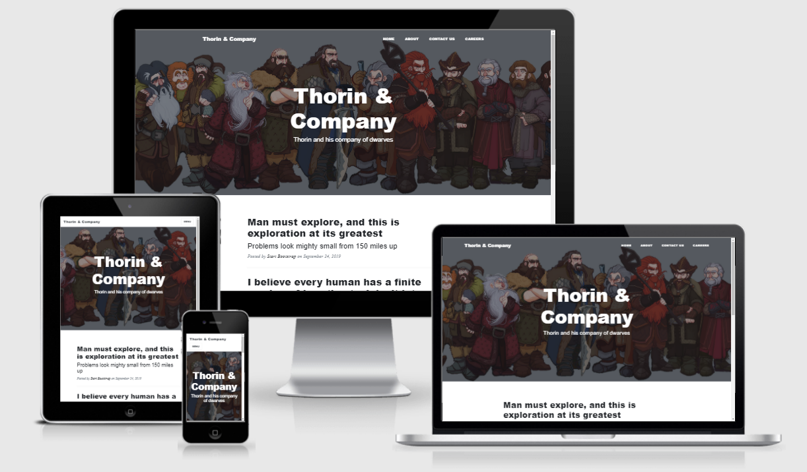

# Thorin and Company - the Flask framework

A project created via Code Institute as part of Diploma in Full Stack Software Development.

The project was an introduction to Flask with key topics covered:
- Flask Framework
- jinja2 templating
- Flask and Data
- Routing

[Link to deployed website](https://thorin-flask-app-aleks.herokuapp.com/)

